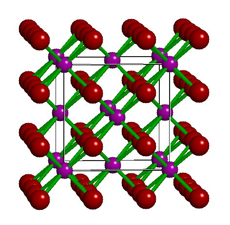
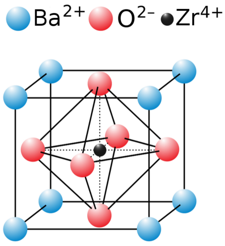

* [Background](#background)
* [Copper](#copper)
* [NiO, nickel (II) oxide](#nio)
* [FeS2, pyrite](#fes2)
* [UO2, uraninite](#uo2)

Background
==========

1.  All XAS data were processed sensibly in athena with E0 chosen
    to be the first peak of the first derivative in &mu;(E). That
    may not be the best choice of E0 in all cases, but it is the
    obvious first choice and the likeliest choice to be made by a
    novice user of the software.

2.  All EXAFS data were Fourier transformed starting at 3/&Aring;
    and ending at a reasonable place where the signal was still much
    bigger than the noise. The choice of 3/&Aring; as the starting
    point was deliberate. The autobk algorithm (and most – all? –
    other algorithms) are often unreliable below about 3/&Aring; due
    to the fact that the &mu;(E) is changing very quickly in that
    region. Thus the data above 3/&Aring; are likely to be reliable
    a free of systematic error due to the details of the background
    removal.

3.  All the materials considered have well-known structures. For these
    tests, we want to avoid the situation where error in a fitting
    model could be attributed to incomplete prior knowledge about the
    structure. That is, we want to isolate the details of the fitting
    model from the details of the theoretical calculation.

4.  The first three examples are dense, crystalline solids for which
    we expect self-consistency to contribute rather little to the
    analysis. The remaining materials all contribute interesting
    features for which self-consistency might play a role.

5.  In the plots, the ranges of the Fourier transform and of the fit
    are indicated by vertical black lines.

6.  Each material is fitted using theory from _feff6_, from _feff85exafs_
    with self-consistency turned off, and from with _feff85exafs_ with
    self-consistency.

7.  For each material that is not a molecule, the analysis is done
    with a sequence of self-consistency radii. This is done to test
    the importance of the consideration of that parameter on the
    analysis. In the case of hydrated uranyl hydrate, this is a
    molecule, but the feff calculation is done of a crystalline
    analogue to the molecule. The effect of self-consistency radius is
    tested in that case.

8.  Where appropriate (bromoadamantane, for example), the `lfms`
    parameter of the `SCF` card is set to 1.

9.  The uranyl calculation was a bit challenging with _feff85exafs_. To
    get the program to run to complation, it was necessary to set the
    FOLP parameter to 0.9 for each unique potential. Given that the
    quality of the fit was much the same as for using _feff6_, this was
    not examined further. Still, this merits further attention for
    this material.

10. We were interested to know if the effect of SCF on EXAFS fitting
    was different for a first shell fit as compared to a more
    extensive fitting model. So fits were generated for the first
    shells only of all materials except for uranyl hydrate for which
    the axial and equatorial scatterers cannot be isolated. Also, Matt
    tells me that, years ago, he and John looked at some _feff6_/_feff8_
    comparisons, but only for first shell fits. These first shell fits
    are intended for comparison to that older work.  _The results of
    the first shell fits are included in the repository, but not on
    this page as they do not tell a different story from the more
    complete fits presented here._

11. All fits were performed with a toolset written by Bruce which uses
    the XAS analysis capabilities of
    [Larch](https://github.com/xraypy/xraylarch/).

Copper
======

The data is the canonical copper foil spectrum of
[Newville, et al. fame](https://github.com/XraySpectroscopy/XAS-Data-Interchange/issues/29). The
fitting model is very simple. There is an S\(_0^2\) parameter (`amp`),
an energy shift for all paths (`enot`), and a volumetric lattice
expansion coefficient (`alpha`). The \(\sigma^2\) values for all paths
were computed using the correlated Debye model and a temperature of
10K, except for the first shell, which has its own \(\sigma^2\)
variable (`ss1`).

The fit included 4 coordination shells, which includes several
collinear multiple scattering paths of the same distance as the fourth
shell single scattering path.

`amp` and `alpha` are unitless. `enot` is eV, `ss1` is &Aring^2, and
`thetad` is K.

Best fit values
---------------

|model|alpha|amp|enot|ss1|thetad|
|:----|:----|:--|:---|:--|:-----|
|feff6|-0.00074(92)|0.96(4)|4.97(49)|0.00382(33)|253(22)|
|noSCF|-0.00046(90)|0.95(4)|5.71(48)|0.00400(33)|239(19)|
|withSCF(3)|-0.00077(104)|0.94(5)|3.45(56)|0.00402(38)|241(22)|
|withSCF(4)|-0.00076(104)|0.94(5)|3.54(56)|0.00402(38)|242(22)|
|withSCF(5)|-0.00077(104)|0.94(5)|3.40(56)|0.00402(38)|241(22)|
|withSCF(5.5)|-0.00077(105)|0.94(5)|3.41(56)|0.00402(38)|241(22)|
|withSCF(6)|-0.00076(104)|0.94(5)|3.46(56)|0.00402(38)|241(22)|

Statistics
----------

|model|&chi;^2|&chi;^2_&nu;|R|
|:----|---------:|-------------:|--------------:|
|feff6|1444.2957|54.3832|0.0145|
|noSCF|1414.0154|53.2430|0.0142|
|withSCF(3)|1820.7826|68.5594|0.0182|
|withSCF(4)|1814.3186|68.3160|0.0182|
|withSCF(5)|1816.7825|68.4088|0.0182|
|withSCF(5.5)|1823.5990|68.6654|0.0183|
|withSCF(6)|1819.3955|68.5071|0.0182|

Fits
----

| feff6 | no SCF | SCF, R=3 | SCF, R=4 | SCF, R=5 | SCF, R=5.5 | SCF, R=6 |
|-------|--------|----------|----------|----------|----------|----------|
| |  | | | | | |

NiO
===

The sample was NiO powder prepared by my colleague Neil Hyatt
(University of Sheffield) and checked by him for phase purity. The
powder was mixed with polyethylene glycol and pressed into a pellet to
make a edge step of 0.78. The data were measured by Bruce at NSLS
beamline X23A2. The simple fiting model to this rocksalt structure
included a S0^2 parameter (`amp`), an energy shift (`enot`), and a
volumetric lattice expansion coefficient (`alpha`).

The fit included 4 coordination shells, 2 with O and 2 with Ni. There
are several collinear multiple scattering paths at the same distance
as the fourth shell Ni scatterer. Each shell has its own &sigma;^2
parameter (`sso`, `ssni`, `sso2`, and `ssni2`, respectively.).

`amp` and `alpha` are unitless. `enot` is eV. `sso`, `ssni`, `sso2`,
and `ssni2` are &Aring;^2.

Best fit values
---------------

|model|alpha|amp|enot|ssni|ssni2|sso|sso2|
|:----|:----|:--|:---|:---|:----|:--|:---|
|feff6|0.00062(146)|0.71(5)|-1.22(54)|0.00546(56)|0.00714(95)|0.00437(120)|0.04205(3218)|
|noSCF|0.00050(152)|0.68(5)|2.49(56)|0.00534(58)|0.00715(101)|0.00468(131)|0.03946(2918)|
|withSCF(2.5)|-0.00021(148)|0.71(4)|-7.34(54)|0.00554(56)|0.00726(97)|0.00468(123)|0.03146(2038)|
|withSCF(3)|-0.00073(145)|0.71(4)|-7.95(53)|0.00555(55)|0.00715(95)|0.00456(119)|0.03368(2237)|
|withSCF(3.7)|-0.00068(145)|0.71(4)|-7.94(53)|0.00555(55)|0.00716(95)|0.00457(119)|0.03344(2213)|
|withSCF(4.2)|-0.00010(149)|0.71(4)|-7.29(55)|0.00554(56)|0.00727(98)|0.00470(124)|0.03099(1996)|
|withSCF(4.7)|-0.00023(148)|0.71(4)|-7.31(54)|0.00554(56)|0.00725(97)|0.00466(123)|0.03167(2060)|

Statistics
----------

|model|&chi;^2|&chi;^2_&nu;|R|
|:----|---------:|-------------:|--------------:|
|feff6|27430.3658|1347.4609|0.0215|
|noSCF|29860.6446|1466.8434|0.0234|
|withSCF(2.5)|28069.2786|1378.8462|0.0220|
|withSCF(3)|26875.8980|1320.2238|0.0211|
|withSCF(3.7)|26950.4623|1323.8866|0.0211|
|withSCF(4.2)|28301.4677|1390.2520|0.0222|
|withSCF(4.7)|28050.1096|1377.9046|0.0220|

Fits
----

| feff6 | no SCF | SCF, R=2.5 | SCF, R=3 | SCF, R=3.7 | SCF, R=4.2 | SCF, R=4.7 |
|-------|--------|----------|----------|----------|----------|----------|
| |  | | | | | |

FeS2
=========

This is one of
[my standard teaching examples](https://github.com/bruceravel/XAS-Education/tree/master/Examples/FeS2).
It’s good for teaching as it is fairly simple – it’s cubic – but it
has a bit of structure and two kinds of scatterers. The data are taken
from
[Matt’s online collection of references](http://cars.uchicago.edu/~newville/ModelLib/search.html).

The model includes a S0^2 parameter (`amp`), an energy shift (`enot`),
and a volumetric lattice expansion coefficient (`alpha`). The first
and second shell S scatterers each get a &sigma;^2 parameter (`ss` and
`ss2`). The third shell of S atoms only contains 2 scatterers. In
practice, floating its &sigma;^2 parameter independently does not
yeild a statistical improvment to the fit, so the `ss2` parameter is
used for the third shell &sigma;^2. Finally a &sigma;^2 parameter is
floated for the Fe shell.

The fitting model includes a variety of multiple scattering paths,
including a triangle between the first shell S and the fourth shell
Fe, and four paths that bounce around among first shell S atoms.

`amp` and `alpha` are unitless. `enot` is eV. `ss`, `ss2`, and `ssfe`
are &Aring;^2.

Best fit values
---------------

|model|alpha|amp|enot|ss|ss2|ssfe|
|:----|:----|:--|:---|:--|:--|:---|
|feff6|0.00092(126)|0.69(2)|2.77(42)|0.00296(41)|0.00366(106)|0.00484(50)|
|noSCF|0.00183(171)|0.65(3)|7.01(57)|0.00294(57)|0.00386(151)|0.00471(68)|
|withSCF(3)|0.00219(191)|0.68(3)|-2.01(63)|0.00311(63)|0.00422(172)|0.00495(77)|
|withSCF(3.6)|0.00212(188)|0.68(3)|-2.15(62)|0.00311(62)|0.00423(170)|0.00495(76)|
|withSCF(4)|0.00212(191)|0.68(3)|-2.17(63)|0.00311(63)|0.00423(172)|0.00494(77)|
|withSCF(5.3)|0.00216(194)|0.68(4)|-1.92(64)|0.00310(64)|0.00421(175)|0.00493(78)|
|withSCF(5.5)|0.00216(194)|0.68(4)|-1.88(64)|0.00310(64)|0.00421(175)|0.00493(78)|

Statistics
----------

|model|&chi;^2|&chi;^2_&nu;|R|
|:----|---------:|-------------:|--------------:|
|feff6|2052.3016|146.4407|0.0064|
|noSCF|3783.2180|269.9491|0.0119|
|withSCF(3)|4639.2799|331.0329|0.0146|
|withSCF(3.6)|4502.7226|321.2889|0.0141|
|withSCF(4)|4634.9046|330.7207|0.0145|
|withSCF(5.3)|4778.2793|340.9511|0.0150|
|withSCF(5.5)|4798.0987|342.3653|0.0151|

Fits
----

| feff6 | no SCF | SCF, R=3 | SCF, R=3.6 | SCF, R=4 | SCF, R=5.3 | SCF, R=5.5 |
|-------|--------|----------|----------|----------|----------|----------|
| |  | | | | | |

UO2
===

The data are the UO2 shown in Shelly’s paper on *Reduction of
Uranium(VI) by Mixed Iron(II)/Iron(III) Hydroxide (Green Rust): 
Formation of UO2 Nanoparticles*:
[`http://dx.doi.org/10.1021/es0208409`](http://dx.doi.org/10.1021/es0208409)

This is an interesting test as it is an f-electron system.

The fitting model follows rather closely to what is described in that
paper, particularly the content of Table 2, although I allow S0^2 to
float (`amp`). Along with an energy shift (`enot`), a &Delta;R and
&sigma;^2 for the first shell O (`dro` and `sso`), a &Delta;R and
&sigma;^2 for the second shell U (`dru` and `ssu`), and a &Delta;R and
&sigma;^2 for the third shell O (`dro2` and `sso2`), there is a
parameter for the number of U scatterers (`nu`).

The model includes the same 6 paths given in Table 2 of Shelly’s
paper.

`amp` is unitless. `enot` is eV. `dro`, `dru`, and `dro2` are
&Aring;. `sso`, `ssu`, and `sso2` are &Aring;2.

Best fit values
---------------

|model|amp|dro|dro2|dru|enot|nu|sso|sso2|ssu|
|:----|:--|:--|:---|:--|:---|:--|:--|:---|:--|
|feff6|0.87(11)|-0.022(14)|-0.055(24)|0.005(11)|4.87(136)|11.43(481)|0.00939(213)|0.01060(440)|0.00488(247)|
|noSCF|0.84(11)|-0.023(15)|-0.024(32)|0.001(12)|8.15(146)|9.27(416)|0.00872(221)|0.01061(618)|0.00382(273)|
|withSCF(3)|0.84(10)|-0.026(13)|-0.013(28)|-0.002(11)|1.63(129)|9.21(376)|0.00894(209)|0.00976(511)|0.00393(250)|
|withSCF(4)|0.84(10)|-0.026(13)|-0.013(29)|-0.003(11)|2.08(130)|9.16(373)|0.00892(209)|0.00972(513)|0.00389(250)|
|withSCF(5)|0.84(10)|-0.026(13)|-0.012(28)|-0.003(11)|1.72(129)|9.18(373)|0.00893(208)|0.00969(508)|0.00391(249)|
|withSCF(5.5)|0.84(10)|-0.026(13)|-0.012(28)|-0.003(11)|1.62(129)|9.17(372)|0.00894(208)|0.00970(509)|0.00391(249)|
|withSCF(6)|0.84(10)|-0.026(13)|-0.012(29)|-0.003(11)|1.71(129)|9.16(372)|0.00893(208)|0.00971(510)|0.00390(249)|

Statistics
----------

|model|&chi;^2|&chi;^2_&nu;|R|
|:----|---------:|-------------:|--------------:|
|feff6|166.2736|22.0712|0.0160|
|noSCF|188.4320|25.0125|0.0181|
|withSCF(3)|169.5918|22.5116|0.0163|
|withSCF(4)|169.9560|22.5600|0.0163|
|withSCF(5)|169.1192|22.4489|0.0163|
|withSCF(5.5)|169.1306|22.4504|0.0163|
|withSCF(6)|169.2412|22.4651|0.0163|

Fits
----

| feff6 | no SCF | SCF, R=3 | SCF, R=4 | SCF, R=5 | SCF, R=5.5 | SCF, R=6 |
|-------|--------|----------|----------|----------|----------|----------|
| |  | | | | | |

BaZrO\(_3\)
===========

r0.25 

In a short paper on the Zr edge of BaZrO\(_3\), [`http://dx.doi.org/10.1016/0921-4526(94)00654-E`](http://dx.doi.org/10.1016/0921-4526(94)00654-E), Haskel et al. (and what a sordid “et al.” *that* was) proposed that shortcomings of feff’s potential model could be accommodated by floating an energy shift parameter for each scatterer species. The concept is that doing so approximates the effect of errors in the scattering phase shifts.

The data are the same as in that paper, although the fitting model is slightly different. Rather than floating \(\Delta R\) parameters for each shell, I used a volumetric expansion coefficient (`alpha`). Along with S\(_0^2\) (`amp`), there are energy shifts for each scatterer (`enot`, `ezr`, and `eba`) and \(\sigma^2\) parameters for each scatterer (`sso`, `sszr`, and `ssba`. The fourth shell O is included in the fit. It gets a \(\sigma^2\) (`sso2`)but uses the energy shift for the O scatterer.

BaZrO\(_3\) is a true perovskite. Zr sites in the octahedral B site. A variety of collinear multiple scattering paths at the distance of the third shell Zr scatterer are included in the fit. The energy shifts are parameterized as described in the paper.

`amp` and `alpha` are unitless. `enot`, `ezr`, and `eba` are eV. `sso`, `sszr`, `ssba`, and `sso2` are Å\(^2\).

BaZrO\(_3\), first shell
========================

This fit includes only the first shell, and a standard 4-paramater model. `amp` is unitless. `enot` is eV, `delr` is Å, and `sso` is Å\(^2\).

bromoadamantane
===============

r0.25 

The data are 1-bromoadamantane. Adamantane is a cycloalkane, meaning that it is a hydrocarbon with rings of carbon atoms. It is also a diamondoid, meaning that it is a strong, stiff, 3D network of covalent bonds. 1-bromoadamantane has one hydrogen atom replaced by a bromine atom.

The material was supplied by my colleague Alessandra Leri of Manhattan Marymount College in the form of a white powder. This powder was spread onto kapton tape which was folded to make a sample with an edge step of about 1.7. The data were measured by Bruce at NSLS beamline X23A2.

This is an interesting test case because it is a molecule (thus the entire molecule can be included in the self-consistency calculation) and because there is measureable scattering from the neighboring hydrogen atoms. While the \(\sigma^2\) of the hydrogen scatterers is not well-determined, the fit is statistically significantly worse when the hydrogen scatterers are excluded.

The fit includes the nearest neighbor C, the next three C atoms, and the neighboring 6 hydrogen atoms. The DS triangle paths involving the first and second neighbor C atoms are also included. The fitting model assumes that the adamanatane anion is very rigid compared to the Br-C bond. Thus, the formula explained in [`http://dx.doi.org/10.1088/1742-6596/190/1/012026`](http://dx.doi.org/10.1088/1742-6596/190/1/012026) is used to constrain the second neighbor C distance to the first neighbor C \(\Delta R\) parameter.

bromoadamantane, first shell
============================

This fit includes only the first shell, and a standard 4-paramater model. `amp` is unitless. `enot` is eV, `delr` is Å, and `ss` is Å\(^2\).

uranyl hydrate
==============

The data are the hydrated uranyl hydrate shown in Shelly’s paper on
*X-ray absorption fine structure determination of pH-dependent
U-bacterial cell wall interactions*,
[`http://dx.doi.org/10.1016/S0016-7037(02)00947-X`](http://dx.doi.org/10.1016/S0016-7037(02)00947-X)

This is an interesting test case because it involves very short
(\(\sim1.78\)Å) oxygenyl bonds in an \(f\)-electron system.

The `AFOLP` card was used to run _feff6_. The `FOLP` card with a value
of 0.9 for each potential was used to get _feff8.5_ to run to
completion.

Following the lead of that paper, feff was run on the crystal sodium
uranyl triacetate. The relevant bit of the structure is shown in the
figure. For the fitting model, scattering paths related to the axial
and equatorial O atoms (red balls) are used in the fit. Other paths
are unused. The parameterization given in Tables 2 and 5 is used in
this fit.

There is an S\(_0^2\) (`amp`) and an energy shift (`enot`). The axial and equatorial oxyegn atoms each get a \(\Delta R\) (`deloax` and `deloeq`) and a \(\sigma^2\) (`sigoax` and `sigoeq`).

`amp` is unitless. `enot` is eV. `deloax` and `deloeq` are Å. `sigoax` and `sigoeq` are Å\(^2\).
